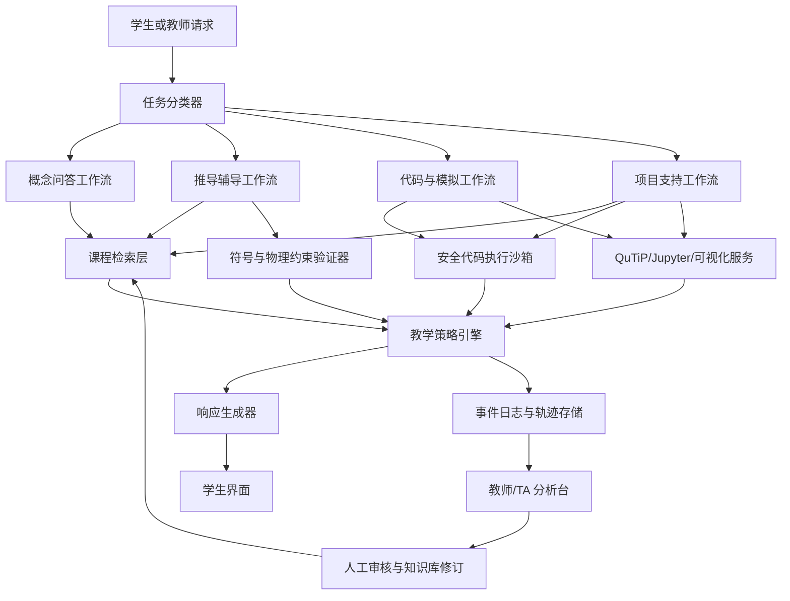
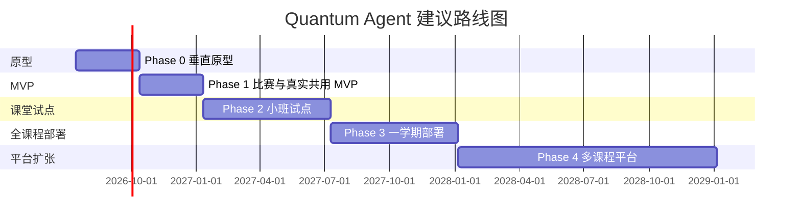

# Quantum Agent 深度研究报告

## 执行摘要

本报告严格围绕你上传的研究任务书展开：目标不是做一个“量子课资料问答机器人”，而是为中国科学技术大学大学量子物理课程起步，设计一个可进入真实教学、可持续迭代、教师可控、能够长期扩展到更多计算型 STEM 课程的生产级教育代理系统 **Quantum Agent**。项目约束也很明确：小型大学团队、早期阶段不应被时髦但高维护的复杂架构绑架，系统必须优先服务真实教学价值，而不是比赛演示或短期惊艳效果。fileciteturn0file0

综合近年生产级 AI Agent 文档、官方工程经验、开放技术框架、以及教育与物理教育研究，最重要的结论是：**Quantum Agent 最适合被定义为“以确定性教学工作流为骨架、以 LLM 为策略层、以验证工具为可信计算层、以教师控制为治理层”的课程内教育代理**，而不是一开始就做成高度自治的多代理系统。Anthropic 在其生产经验中反复强调，最成功的 agent 实现通常来自“简单、可组合”的模式，而不是复杂框架；并明确区分了“预定义代码路径的 workflow”与“模型自主决定流程的 agent”。对于定义清晰的任务，先从最简单方案做起，只有在复杂性被证明确实改善结果时才增加层数，是更稳妥的路线。citeturn51view0

第二个结论是，**教育代理不能按“生产力代理”的成功标准来设计**。生产力代理追求更快完成任务；教育代理则必须区分“完成作业”和“学会了”。近两年教育研究已经反复证明：当学生把 LLM 当作“替自己完成练习的外包者”时，短期任务表现可能上升，但独立考试、迁移、持续记忆和认知投入可能下降；当 AI 被限制在提示、引导、支架和人类辅导增强的角色时，才更可能带来真实学习收益。Tutor CoPilot 的随机对照试验显示，给真人辅导员提供 AI 辅助后，学生掌握率提升 4 个百分点，低评分辅导员对应学生的提升达到 9 个百分点；与此同时，研究也发现更好的结果部分来自“更少直接给答案、更多引导性策略”。citeturn14academia0 编程教育中的因果研究同样显示：LLM 作为“讲解型私人导师”时有益，但替学生完成练习会伤害学习；学生主观感到的帮助往往高于真实学习收益。citeturn47academia0turn17academia4turn17academia1

第三个结论是，**量子物理是一个特别适合“工具增强型教育代理”的学科**。原因不只是因为内容难，而是因为量子力学中大量关键错误既来自概念误解，也来自形式化推导、边界条件、厄米性、归一化、时间演化与测量规则等“可验证但不宜只靠 LLM 自说自话”的环节。上层量子力学研究表明，学生在波函数合法性、测量后状态、期望值时间演化、Bound/Scattering State、哈密顿量作用与表象切换等方面存在系统性困难，而且本科生和研究生都会出现相似误区。citeturn19academia0turn20academia2 这意味着 Quantum Agent 的价值不在于“回答更多问题”，而在于把**课程知识、误解诊断、逐步推导反馈、符号/数值验证、可视化和教师分析**整合成一个统一闭环。就我检索到的公开系统看，尚无成熟产品把这六件事同时做好；相关系统通常只覆盖其中一到三项，这是 Quantum Agent 最重要的原创空间之一。这个判断是对现有 agent、ITS、QuILT、IBM Quantum Composer、QuTiP、Jupyter 及近两年 LLM tutor 系统能力边界的综合推断。citeturn51view0turn32view1turn33view3turn19academia2turn21academia2turn41view2turn40view0turn41view0turn18academia3turn22academia1

第四个结论是，**Quantum Agent 的第一代系统不应追求“全自治”，而应追求“高可校验、高可追踪、高可升级”**。当前生产级 agent 平台的共同点不是“更像人”，而是更强调工具接口、状态持久化、人类监督、观测与评测。GitHub Copilot cloud agent 在 GitHub Actions 驱动的临时环境里完成仓库研究、规划、改动和 PR；LangGraph 把耐久执行、人类介入和状态化编排视为核心能力；Google 的 ADK 明确把 workflow、动态路由、多代理、评测、观测和治理看作完整生产栈；PydanticAI 强调类型安全和系统化评测。citeturn32view1turn33view3turn50view0turn50view3turn32view3 对 Quantum Agent 而言，这些经验对应的不是“要不要做多个 agent”，而是“哪些环节必须 deterministic，哪些环节可以 model-driven”。

第五个结论是，**初始版本最值得做的不是开放式多代理研究助理，而是四条高频垂直闭环**：  
其一，课程问答与概念澄清；其二，推导过程诊断与逐步提示；其三，Python/数值模拟辅导；其四，项目型作业支持与教师侧分析。前两条带来最快教学价值，后两条形成长期壁垒，因为量子课程越来越需要代码、模拟、图形与实验性理解。IBM Quantum Composer 已经证明“拖放—可视化—OpenQASM/代码联动”对量子学习极有吸引力；Jupyter 和 QuTiP 则提供了开源、可重复、可扩展的计算实验载体。citeturn41view2turn41view3turn41view0turn40view0turn22academia3

第六个结论是，**教师控制不是附加功能，而是产品合法性与可维护性的核心**。教育代理必须允许教师定义教学目标、限制答案释放策略、维护知识库、审核高风险回复、查看班级误区分布，并能在人机协同里扮演最后裁决者。Khan Academy 在推广 Khanmigo 时始终把教师支持、写作教练和课堂整合放在中心位置；但与此同时，真实课堂和媒体观察也提醒我们：如果学生不会提问，或系统只是“更方便地给答案”，效果会迅速变差。citeturn39search6turn16news2turn18news0

第七个结论是，**不要把“模型会解释”误认为“模型会验证”**。在教育里，最危险的错误往往不是答非所问，而是“说得看起来很对”。近年的研究表明，LLM 在数学任务认知层级分类上平均只有约 63% 准确率；在手写数学解答评分上，即便给 rubric，整体精度仍不足以支持真实部署。程序反馈生成也存在明显幻觉与漏检。citeturn39academia7turn17academia7turn22academia2 因此 Quantum Agent 的数学、代码和模拟相关功能必须建立在外部工具和可执行验证之上，而不是只靠语言模型“解释自己”。

第八个结论是，**真实课堂部署比 demo 难得多，失败往往来自运营而不是模型**。LAUSD 的 “Ed” 聊天机器人案例说明，即使教育机构大规模宣布上线 AI 助手，若供应商治理、数据治理、运维可靠性和机构边界没有处理好，项目也可能迅速失败。citeturn39search1turn39news0 这对 Quantum Agent 的启示是：先做院系内、课程内、教师可控的有限 Pilot，而不是一开始走大型机构级宣传。

第九个结论是，**最合理的产品战略是“课程产品 → 校内教学平台 → 研究平台/开源组件化”三阶段组合**，而不是直接押注纯商业化独立产品。中国高校近期确实在加速引入 AI 课程与 AI 教学能力建设，政策和供给侧趋势有利；但教学产品的真正壁垒仍是课程资产、教师关系、评测数据、误解图谱和连续学期迭代，而不是单点模型能力。citeturn45news0turn45news1turn45academia8

第十个结论是，**Quantum Agent 最有防守力的长期优势不是“比通用大模型更聪明”，而是“在量子物理课程中更可信、更会教、更会诊断、更容易被教师纳入教学”**。这要求系统在三个维度同时打磨：一是课程语义与误解结构；二是验证型工具链；三是教师工作流。少了任一项，都容易退化为“更贵的教材聊天框”。fileciteturn0file0

### 最关键发现与直接设计含义

| 最关键发现 | 对 Quantum Agent 的直接含义 |
|---|---|
| 生产级 agent 成功模式通常是“简单、可组合、可观测” | 先做 workflow-first，不先做全自治多代理 |
| 教育成效取决于支架与控制策略，而非“更会回答” | 必须实现 hint policy、answer gating、teacher override |
| 量子力学错误高频发生在“概念 + 形式化”交界处 | 必须把课程知识、形式验证、模拟工具耦合起来 |
| LLM 单体不可靠于验证数学/代码/评分 | 把 verifier、executor、simulator 放在可信链条里 |
| 教师控制决定落地可能性 | 教师台与 TA 台必须从 MVP 开始就存在 |
| Benchmark ≠ 持续使用价值 | 评测框架必须加入重复使用率、独立考试表现、答案泄漏率 |
| 课堂部署失败常源于治理与运维 | 先课程内试点，再院系级扩张 |
| 现代 agent 平台强调 state、trace、eval | 事件日志、轨迹回放和失败集建设必须前置 |
| 量子物理教学高度依赖可视化与计算实验 | Jupyter/QuTiP/可视化服务是壁垒，不是附属件 |
| 中国高校 AI 教学供给在增强 | 先做“校内课程产品 + 研究平台”，时机合理 |

以上归纳综合自任务书、生产级 agent 官方文档、教育实证研究、物理教育研究与校内部署经验文献。fileciteturn0file0 citeturn51view0turn32view1turn33view3turn50view0turn50view2turn14academia0turn18academia1turn18academia3turn19academia0turn20academia2turn41view2turn40view0turn39search1turn45news1

### 当前团队最危险的误区

| 危险误区 | 为什么危险 |
|---|---|
| “多代理一定更先进” | 复杂性、成本、延迟、调试负担会先于价值到来 |
| “会把题做出来就是会学” | 这会诱导系统优化短期完成率而非独立迁移能力 |
| “Socratic 就一定好” | 过度追问会造成挫败、冗长和退出 |
| “RAG 解决了正确性” | RAG 不能替代符号验证、代码执行和物理约束检查 |
| “先把学生端做强，教师端以后补” | 没有教师控制就无法进课堂，也无法持续维护 |

这些误区分别由生产级 agent 工程经验、教育干预研究和量子物理课程需求共同否定。citeturn51view0turn47academia0turn18academia3turn39academia7turn19academia0

### 当前最值得优先回答的未解问题

| 未解问题 | 为什么必须尽快验证 |
|---|---|
| 学生最需要哪一种“最小可用帮助” | 决定 MVP 价值密度 |
| 逐步提示的最佳释放策略是什么 | 决定是否会形成依赖 |
| 哪些量子推导环节能被工具可靠验证 | 决定可信链条边界 |
| 教师愿意维护多大规模的课程知识资产 | 决定产品可持续性 |
| 真实课程中哪些日志最能预测学习收益 | 决定评测和研究平台价值 |

## 研究方法与边界

本报告按照任务书要求，优先使用一手和准一手材料：公开可访问的官方技术文档、官方工程博客、开放技术报告、公开教育研究论文/摘要、物理教育研究论文，以及必要的可信新闻材料；同时把经典 ITS 研究作为历史底座，把 2022 年至 2026 年 7 月的 agent 与教育代理发展作为重点时间窗口。项目目标、课程背景、边界条件与报告结构要求以你上传的任务书为准。fileciteturn0file0

检索时，我把材料分成五类：生产级 agent 官方文档；开放 agent 框架；教育代理/ITS 研究；物理教育与量子教育研究；以及高校与机构部署案例。纳入标准是至少满足以下之一：有真实产品文档、可验证的工程细节、同行评审或高质量预印本、随机/准实验设计、或可核验的大规模部署证据。排除标准主要包括：纯营销宣传、没有明确对象任务的概念稿、只有“会用大模型”但缺少交互与评测设计的普通聊天助手。fileciteturn0file0

需要特别说明的是，当前检索环境对部分付费数据库和部分期刊全文访问有限，因此对少数经典 ITS 项目的“精确效果值”我优先使用公开综述、开放摘要和较新的系统回顾来做交叉验证，而不假装掌握完整不可公开获取的全文细节。凡是证据不足处，我都用更谨慎的措辞，避免把“部署存在”误写成“教育有效”。citeturn13academia0turn13academia3turn35academia0turn37academia1

为了后续决策清晰，我先给出一个对 Quantum Agent 最有用的分类框架。

### Quantum Agent 的初始定位分类

| 概念 | 精确定义 | Quantum Agent 是否应采用 |
|---|---|---|
| 聊天机器人 | 单轮或少量多轮对话，弱工具、弱状态 | 不是目标形态 |
| Copilot | 在用户主导任务中提供建议与局部自动化 | 学生端和教师端都应部分具备 |
| Workflow | 预定义代码路径编排 LLM 与工具 | 初期核心骨架 |
| Agent | 模型动态决定步骤与工具使用 | 仅在开放性任务中局部使用 |
| Multi-agent | 多个代理分工协作或层级委派 | 初期不宜作为默认架构 |
| ITS | 具有领域模型、学生模型、教学策略的教学系统 | Quantum Agent 必须继承其核心思想 |
| LLM Tutor | 用自然语言做讲解与诊断的现代 tutor | 是界面层，不是系统全貌 |
| Teacher Copilot | 面向教师进行备课、审核、分析、维护 | 必须从一开始纳入 |
| Autonomous educational agent | 能在较少干预下运行完整教学/评测环节 | 只能在后期、限定场景中局部开放 |

这个分类与 Anthropic 对 workflow/agent 的区分、Google ADK 对 workflow agents 与动态路由的区分，以及经典 ITS 对“领域模型—学生模型—教学模型”的强调是一致的。citeturn51view0turn50view3turn13academia3turn35academia0

## 生产级 AI Agent 的共性规律

### 生产级系统真正重视的不是“会思考”，而是“会落地”

OpenAI、Anthropic、GitHub、Google、LangGraph 与 PydanticAI 这些一线文档放在一起看，生产级 agent 的共性很清楚：它们都把**工具调用、状态管理、评测、观测、权限与人类介入**视为一等公民。OpenAI 把 Responses API 设为未来方向，并把 web search、file search、computer use 等工具直接内建到 agent 体系里；GitHub 把云端编码代理放到带日志和 PR 生命周期指标的受控环境中；Google ADK 则把构建、运行、评测、观测、治理和部署视为一个整体平台；LangGraph 则围绕耐久执行、人类介入与状态化编排展开；PydanticAI 则强调 type-safe 依赖注入与系统化 eval。citeturn49view0turn49view1turn32view1turn50view0turn50view2turn33view3turn32view3

这对 Quantum Agent 的直接启示是：**不要把“好提示词”当成核心资产**。真正决定系统上限的是工具接口是否清晰、状态是否可恢复、日志是否可追踪、失败是否可评估，以及 teacher policy 能否覆盖高风险教学行为。Anthropic 在工具设计中甚至明确提出，要像做 HCI 一样做 ACI，也就是“agent-computer interface”；工具的格式如果不自然、需要额外转义或不易被模型稳定写出，可靠性会显著下降。citeturn51view0

### 复杂架构只在少数任务里真正值得

Anthropic 给出的经验几乎可以直接转写成 Quantum Agent 的设计原则：  
对固定且清晰可分解的任务，用 prompt chain、routing、parallelization 就够了；  
只有当子任务数量与类型无法预先确定、而且环境反馈能持续提供 ground truth 时，orchestrator-worker 或自主 agent 才更合适。citeturn51view0

把这一原则映射到量子物理课程，答案也相当明确：  
课程问答、课程知识检索、学习路径推荐、作业规则解释、甚至许多常规推导纠错，其实都更像 **workflow**；  
真正接近 **open-ended agent** 的，是项目式编程、长时数值模拟、跨文件代码调试、或学生自拟研究型问题。也就是说，多代理不应该是系统默认形态，而应该是少数开放任务的“增强模式”。这一判断也与 Google ADK 的“可预测 pipeline 与动态路由并存”思路，以及 GitHub cloud agent 把自治限制在受控代码环境中的做法一致。citeturn50view3turn32view1

### 成熟系统的一个关键差异是可中断、可回看、可评测

OpenAI Deep Research 之所以代表 agent 的一个成熟方向，不是因为它“像研究员”，而是因为它把复杂任务拆成可追踪步骤、有来源、有可中断进度，并在 2026 年更新中进一步支持 MCP / app 连接与 trusted sites 限定。citeturn52view0turn52view1turn52view2 GitHub cloud agent 也是类似逻辑：它在 GitHub-hosted 开发环境中执行，能先 research、再 plan、再改代码、再决定是否开 PR；管理员还能看 PR 生命周期与合并效率指标。citeturn32view1

Quantum Agent 因而不应只是“输出答案”，而应输出**教学决策轨迹**：系统看了哪些课程资料、调用了哪些验证器、判断学生处于哪类误区、为何先给 hint 而不是 full solution、哪些地方置信度低、是否需要 TA 接管。没有这些轨迹，教师不可能真正信任系统，也不可能形成持续迭代的数据基础。citeturn33view3turn50view2turn32view3

### 代表性生产级系统对比

| 系统 | 主要用户 | 典型任务 | 架构姿态 | 强项 | 主要短板 | 对 Quantum Agent 的启示 | 证据级别 |
|---|---|---|---|---|---|---|---|
| OpenAI Deep Research | 知识工作者 | 多步资料搜集与综合 | 单 agent + 工具 | 深度检索、引用、进度可视化 | 成本、时延高 | “研究模式”适合教师备课与项目辅导，不宜默认用于日常答疑 | D |
| OpenAI Responses API | 开发者 | 可工具化 agent 构建 | API 工具编排 | web/file/computer use 一体化 | 需自建业务控制层 | Quantum Agent 可直接借鉴“工具即能力” | D |
| Anthropic workflow/agent 模型 | 开发者 | 各类 agentic workflow | 明确区分 workflow 与 agent | 简化复杂度、强调 ACI | 仍需自行产品化 | 是 Quantum Agent 初代架构最好的原则来源 | D |
| Claude Code | 开发者 | 代码修改、命令执行 | 受控代码 agent | 代码库上下文、命令、权限模式 | 主要面向软件工程 | 对“项目式编程辅导”特别有参考价值 | D |
| GitHub Copilot cloud agent | 软件团队 | 仓库研究、计划、改动、PR | 云端受控 agent | Actions 环境、日志、指标 | 领域限定在代码 | Quantum Agent 的代码/项目工作流应模仿其受控环境 | D |
| Google ADK | 企业开发者 | 构建/调试/部署 agent | workflow + 动态路由 + 多代理 | 评测、观测、治理、部署完整 | 平台化成本高 | 适合中后期平台化，不适合一开始全量照搬 | D |
| LangGraph | 开发者 | 长时状态 agent | 低层编排 runtime | durable execution、HITL、memory | 抽象较低，开发工作多 | 适合 Quantum Agent 的“有限自治 + 强状态”骨架 | D |
| PydanticAI | 开发者 | 类型安全 agent 开发 | 单 agent / workflow | type-safe、eval、依赖注入 | 要自己设计交互系统 | 适合 verifier/tool schema 层 | D |
| AutoGen | 研究/开发者 | 多代理实验与任务协作 | 多代理框架 | 原型快、研究生态强 | 生产治理不总是天然完备 | 适合研究原型，不应直接做课堂首发底座 | D |
| Magentic-One | 研究/开发者 | 通用复杂任务 | 多代理编排 | 展示复杂任务分解能力 | 通用性强但产品边界弱 | 提醒我们多代理只在开放复杂任务里有意义 | D |
| OpenHands SDK | 开源开发者 | 软件工程 agent | 可组合 SDK + 沙箱 | 原生沙箱、model-agnostic、生命周期控制 | 仍主要面向编码 | 对 Quantum Agent 的安全代码执行很有借鉴 | C |
| IBM Quantum Composer | 量子学习者 | 量子电路构建与运行 | 图形 + 代码联动 | drag-and-drop、QPU/仿真、OpenQASM | 偏量子计算而非量子力学课程 | 证明“图形—代码—运行”一体化是高价值交互 | D |

上表综合了官方文档、开放技术栈与研究报告。citeturn52view0turn49view0turn49view1turn51view0turn31view0turn32view1turn50view0turn50view3turn33view3turn32view3turn4search3turn6search0turn34academia0turn41view2

## 教育代理与 ITS 的证据基础

### 经典 ITS 已经回答了很多今天 LLM 圈重新提出的问题

ITS 研究几十年积累出的共识是：**教学系统至少要处理三个模型**——领域模型、学生模型、教学策略模型。大语言模型能改善自然语言表达和开放任务覆盖面，但并没有自动替代 student modeling、hint policy、knowledge tracing、mastery definition 和 teacher integration。关于知识追踪与 ITS 的系统回顾指出，LLM 可能帮助处理冷启动、稀疏数据和非结构化教育数据，但现阶段仍严重依赖结构化有限数据，且尚未同时解决可解释性与预测性能。citeturn13academia3

换句话说，Quantum Agent 不应该犯一个常见错误：把“能跟学生自然对话”误当成“已经成为 tutor”。真正的 tutor 必须知道自己在教什么、学生掌握到哪里、下一步该给什么难度和什么形式的反馈。经典 ITS 的历史价值正是在这里。citeturn35academia0turn13academia3

### 现代 generative AI tutor 的最大分水岭是是否控制答案泄漏

最近两年的教育实证最重要的发现之一，是**生成式 AI 的效果强烈依赖使用方式**。Tutor CoPilot 的随机试验显示，AI 不直接替学生完成题目，而是帮助真人 tutor 采用更高质量策略，学生掌握率才显著提升。citeturn14academia0 Rori 在加纳的长期学校试验中，以低带宽 WhatsApp 数学对话 tutor 形式运行，取得了约 0.37 的显著效果量，说明“窄域、频繁、受控”的聊天式 tutor 可以产生规模化价值。citeturn18academia1

但反过来，学习风险也非常清楚。数学证明 LLM-Tutor 研究显示，系统能改善作业表现，但对考试成绩没有显著提升，且低自我效能学生更频繁使用聊天机器人时，反而部分导致较低期中成绩。citeturn18academia3 编程课程因果研究进一步发现：对话型解释有帮助，但把练习外包给 LLM 会伤害学习；学生自感收益高于真实收益。citeturn47academia0 这意味着 Quantum Agent 的“不给答案策略”不是道德姿态，而是实证上必要的设计。

### 教师与助教不应被移出回路

Tutor CoPilot 的结果还暗示了一个对高校特别关键的方向：**AI 先增强 TA，再增强学生，往往比直接面对学生更稳**。citeturn14academia0 同时，Khanmigo 的公开进展也显示，真正可持续的教育 AI 往往会逐步把教师工具、写作教练、课堂配套和教师培训一起做进去，而不是只做一个学生聊天框。citeturn39search6turn16news2

对 Quantum Agent 而言，这意味着教师端和 TA 端不是后端附属控台，而是产品主轴。因为真正稀缺的不是“回答机会”，而是“把相似问题归类、把高风险问题升级、把全班误区反馈给教师”的能力。fileciteturn0file0

### 现代教育代理与研究系统对比

| 系统或系统族 | 主要对象 | 学科 | 教学核心 | 验证/控制机制 | 学习证据 | 对 Quantum Agent 的价值 | 证据级别 |
|---|---|---|---|---|---|---|---|
| AutoTutor | 学生 | 计算机素养/物理等 | 对话式教学、深度推理 | 规则 + NLP 匹配 | 历史上有多次正向学习结果 | 证明“对话 tutor”可行，但 authoring 成本高 | B-D |
| Cognitive Tutor/MATHia | 学生 | 数学 | 模型追踪、步骤反馈 | 显式认知模型 | 经典 ITS 代表 | 说明学生模型与步骤级反馈的重要性 | B-D |
| ALEKS | 学生 | 数学/化学等 | 知识空间、自适应掌握 | 周期性 knowledge check | 长期平台化应用 | 说明 mastery 与 topic sequencing 的价值 | C-D |
| ASSISTments | 教师/研究者/学生 | 数学 | formative assessment + 在线实验 | A/B 测试基础设施 | 支持大量平台实验 | 可借鉴“把系统做成实验平台” | C |
| Andes / 物理 ITS 系 | 学生 | 物理 | 逐步问题求解支持 | 领域约束 + hint | 物理 ITS 传统代表 | 对量子推导辅导有历史参照 | C-D |
| QuILT 系列 | 学生 | 量子物理 | 预测—可视化—解释 | 教学脚本 + 仿真 | 多项研究显示概念理解改善 | 是 Quantum Agent 课程设计的直接先例 | B |
| Khanmigo | 学生/教师 | 多学科 | 支架式 AI 辅导与教师工具 | 产品策略与教师配套 | 课堂试点丰富，但公开强因果学习证据有限 | 适合参考产品化与教师集成 | D |
| Tutor CoPilot | 真人 tutor | K-12 多科 | AI 辅助 human tutor | 约束“不给答案”策略 | RCT：4pp，总体显著；低评分 tutor 9pp | 最能支持“TA Copilot”路线 | A |
| Rori | 学生 | 数学 | 聊天式高频练习 | 窄任务、低带宽 | 八个月学校干预，效应量约 0.37 | 说明窄域 tutor 可大规模有效 | B |
| CodeAid | 学生 | 编程 | 概念提示、伪代码、错误注释 | 避免直接给完整代码 | 700 人部署研究 | 直接映射到代码辅导策略 | B-C |
| LLM-Tutor | 学生 | 数学证明 | proof review + chatbot | 区分 review tutor 与通用聊天 | 作业提升、考试不显著 | 说明“验证型 tutor”优于泛聊天 | B |
| aiPlato | 学生 | 物理 | step-wise feedback | 鼓励 productive struggle | 真实课堂 pilot，非因果 | 贴近“物理作业逐步反馈”形态 | C |
| AI Peer | 学生 | 物理概念 | 对话纠错、非权威同伴 | 明示 AI 可能出错 | RCT：post-test +10.5pp | 说明“同伴型而非权威型”也可能有效 | A |
| 通用 GenAI 工具直接进课堂 | 学生 | 多学科 | 无特定 pedagogy | 控制弱 | 效果强依赖使用方式 | 是最应避免的参照物 | B |

这张表以公开论文、公开产品材料和研究摘要为基础，结论侧重“设计遗产”而不是营销声量。citeturn35academia0turn13academia3turn48academia2turn14academia0turn18academia1turn22academia1turn18academia3turn46academia0turn46academia1turn39search6turn47academia0

### 一个很重要但容易被忽视的事实

教育场景里，**模型“懂学科”并不等于模型“懂教学”**。例如，2026 年关于 AI 工具分类数学任务认知要求的研究表明，十一款主流通用与教育专用 AI 工具平均只有约 63% 的准确率；这说明很多看起来“会解释”的工具，其实并不稳定地理解题目需要的认知深度。citeturn39academia7 类似地，GPT-4o 对大学数学手写答案评分仍不够准确，尚不足以替代真实评分流程。citeturn17academia7 因而 Quantum Agent 最初不应把“自动评分”放在核心价值里，而应优先做“诊断 + 提示 + 验证 + 升级给 TA”。

## 量子物理课程的专门需求

### 量子力学的难点不是“难”，而是“多层表征错位”

上层量子力学学习困难综述指出，学生常见问题并非单点公式记忆，而是在**物理图像、数学形式、测量语义和时间演化**之间来回切换时出现系统性断裂。citeturn19academia0 一维量子概念测评研究进一步表明，学生在可接受波函数、束缚态与散射态、测量、期望值、哈密顿量角色和时间依赖等方面普遍不稳，而且研究生课程也未必自动提高概念理解，因为课程经常过于偏重量化计算。citeturn20academia2

因此，Quantum Agent 的“课程知识库”不能只是 PPT、讲义和习题答案集合，而应包含**误解图谱**。对 USTC 这样的本科/研究生层级量子课程，至少应先建立下列误区簇：

| 误区簇 | 具体典型错误 | 推荐的 agent 行为 |
|---|---|---|
| 波函数与态空间 | 把任意光滑函数都当成合法态；忽略边界与归一化 | 先做合法性检查，再要求学生解释物理边界 |
| 测量与塌缩 | 把测量当作“读出已有值”；不区分本征态与一般态 | 用短诊断问题确认学生是概念错还是计算错 |
| 时间演化 | 不理解哈密顿量与定态/非定态的关系 | 结合可视化演化与期望值变化 |
| 隧穿与势阱 | 混淆概率振幅、概率密度与经典粒子图像 | 强制切换表征：公式 → 图像 → 口头解释 |
| 自旋与角动量 | 把三维空间转动直觉硬套到 ket/算符 | 用 Bloch 球或矩阵演算做多表示对照 |
| 微扰与简并 | 把一级修正公式机械套用 | 要求说明适用条件和对称性 |
| 多电子与分子轨道 | 忽略交换、屏蔽、近似边界 | 把“物理近似为何成立”变成必须回答的问题 |
| 计算模拟 | 代码能跑但物理量不守恒或单位错 | 把数值稳定性、单位、归一化当成自动检查项 |

这个初步 taxonomy 直接来自量子教育研究结论，并结合任务书中计划覆盖的项目主题做了课程化重写。fileciteturn0file0 citeturn19academia0turn20academia2

### QuILT 与可视化给出的直接启示

一系列 QuILT 工作已经展示了对量子双缝、单光子 Mach–Zehnder 干涉、量子密钥分发、自旋 Larmor precession 等内容，**把研究验证过的教学脚本与交互仿真结合起来**，能够显著帮助学生建立更健壮的概念理解。citeturn19academia2turn19academia3turn21academia2turn21academia3turn21academia4 这意味着 Quantum Agent 不应只是“围绕文本聊天”，而应在关键主题中实现一种固定的 **预测—仿真—解释—反思** 流程。

这也是我建议把 Quantum Agent 的第一批高价值内容锁定在四类任务书给定项目上的原因：隧穿与波包传播、氢原子轨道与外场微扰、变分与多电子近似、分子轨道与光谱。它们都天然适合把公式、数值、图像与语言解释串到一起。fileciteturn0file0

### 计算实验平台不是锦上添花，而是知识媒介

Jupyter 明确把 notebook 定义为开放文档格式，能同时容纳代码、文字、公式与富输出；这非常适合做可重复的量子课程实验。citeturn41view0 QuTiP 提供了量子态、算符、张量积、测量、时间演化、主方程、可视化和 Bloch 球等丰富能力，可作为 Quantum Agent 数值层的核心开源引擎。citeturn40view0 IBM Quantum Composer 则说明了图形化构建、OpenQASM 代码联动、状态可视化和硬件/模拟器切换的教育吸引力。citeturn41view2turn41view3

因此，Quantum Agent 的一个关键差异化方向应是：  
**不是“会讲量子”，而是“会带着学生在 notebook / 仿真 / 可视化里学量子”。**  
这也正是通用教育 AI 很难复制的地方。

## Quantum Agent 的目标产品与技术架构

### 我建议的基础判断

Quantum Agent 在第一阶段应被设计成：**课程内、教师控制、workflow-first、tool-verified、student-model-lite 的教育代理系统**。  
这里的每个词都有原因：

- **课程内**：先把知识边界做窄，才能把正确性和 pedagogy 做深。  
- **教师控制**：没有教师政策层，就没有真实部署。  
- **workflow-first**：先用确定性路径保障稳定性。  
- **tool-verified**：关键数学与代码环节必须可执行验证。  
- **student-model-lite**：先做可操作的掌握度、误区、提示依赖和历史记录，不急于做花哨心理建模。  

这一判断同时符合任务书的长期目标与当前技术现实。fileciteturn0file0 citeturn51view0turn33view3turn22academia1turn18academia3

### 推荐的最小可行产品模型

#### 学生侧

学生看到的不是一个统一聊天框，而应是四种模式统一入口：

| 模式 | 目标 | 默认输出 | 何时升级 |
|---|---|---|---|
| 概念问答 | 澄清定义、物理意义、课程内容 | 简短解释 + 引导问题 + 课程引用 | 置信度低、跨章节冲突时 |
| 推导辅导 | 检查步骤与逻辑 | 定位错误步 + hint，不直接给整解 | 多轮失败或高挫败迹象时 |
| 代码与模拟 | 帮助写、改、跑、解释代码 | 代码片段 + 执行结果 + 可视化解读 | 安全/资源限制碰撞时 |
| 项目支持 | 规划、实验、结果解读、报告 | 任务拆分 + notebook scaffold + review | 长任务中断或质量门未过时 |

默认策略应是“先短后长、先诊断后讲解、先 hint 后 solution、先课程内证据后外部扩展”。这一交互哲学与 Anthropic 对透明规划、简单设计、清晰工具接口的原则一致，也和教育研究对避免 answer leakage 的要求一致。citeturn51view0turn14academia0turn47academia0

#### 教师与 TA 侧

教师侧至少应有三块面板：  
一块是 **课程知识维护**，用于上传、版本化、标注文档；  
一块是 **教学策略配置**，用于设定 hint 层级、可否给完整解、哪些题只允许 Socratic、哪些问题必须升级给人；  
一块是 **班级分析**，用于查看高频误区、失败轨迹、最常触发的验证器报错和最常升级的问题类型。fileciteturn0file0

TA 侧则更像 Tutor CoPilot：不是替 TA 消失，而是替 TA 放大。核心功能应是会话分诊、困难会话摘要、批量同类错误聚合、讲义补丁建议和习题课素材生成。Tutor CoPilot 的证据已经说明，这类“人类辅导员增强”往往比直接完全自动化更有效、更稳。citeturn14academia0

### 推荐技术架构

这个架构故意没有把“多个 agent”画成主角。真正的主角是四层：  
**工作流层、知识层、验证层、治理层**。  
LLM 主要扮演分类、解释、提示、计划和归纳角色；而知识检索、符号检查、代码执行、仿真与 access control 则尽量 deterministic。这样可以把“会教”和“可信”拆开治理。citeturn51view0turn33view3turn50view0turn34academia0

### 组件级建议

| 组件 | 是否必要 | 应偏 deterministic 还是 model-driven | MVP 做法 | 成熟形态 | 建议 |
|---|---|---|---|---|---|
| 课程知识库 | 必须 | deterministic 检索 + model 总结 | 向量检索 + 课程标签 | 版本化知识库 + 片段级 provenance | 先做 |
| 误区图谱 | 必须 | 混合 | 人工定义一级 taxonomy | 对话日志驱动持续扩展 | 先做简版 |
| 教学策略引擎 | 必须 | deterministic policy | 题型/模式规则 | 结合 student state 的策略机 | 先做 |
| 学生模型 | 必须 | 混合 | 历史问题、误区计数、提示依赖 | 知识追踪 + mastery estimates | 先做 lite 版 |
| 符号/物理验证器 | 必须 | deterministic | 归一化、边界、厄米性、单位和简单代数检查 | 更深的符号推导校验 | 先做基础版 |
| 安全代码执行 | 必须 | deterministic | 沙箱 Python + 资源限制 | notebook worker pool + 队列调度 | 先做 |
| 数值模拟 | 必须 | deterministic | QuTiP 模板脚本 | 自定义课程模板库 | 先做 |
| 可视化 | 必须 | deterministic + model 注释 | Matplotlib/Plotly | 交互式 exploration 面板 | 先做基础版 |
| 多代理调度 | 不是必须 | model-driven | 不做默认 | 仅用于长项目支持 | 暂缓 |
| LMS 集成 | 重要 | deterministic | 最初只做导出/导入 | 深度单点登录与成绩流转 | Pilot 后做 |
| 教师分析台 | 必须 | deterministic 汇总 + model 摘要 | 高频误区与失败会话列表 | 课程周报与干预建议 | 先做 |
| 自动评分 | 非首要 | 混合但高风险 | 只做 formative，不做总评 | 局部 rubric-assisted review | 暂缓 |

### 为什么我不建议初期默认多代理

首先，Anthropic 的生产经验很明确：复杂性需要被证实，而不是被想象。citeturn51view0  
其次，Google ADK 虽然支持多代理，但把 workflow agent 和可预测 pipeline 同样视为核心；这意味着最成熟的平台也没有把“多代理”当唯一答案。citeturn50view3  
再次，Quantum Agent 的大部分高频任务具有明确任务边界和强工具依赖，本来就更适合工作流。  
最后，课堂系统一旦多代理化，日志解释、权限隔离、成本控制和教学审计都会明显变难。对小型大学团队而言，这通常是不必要的早期复杂度。fileciteturn0file0

## 路线图、研究议程与最后建议

### 分阶段路线图

#### 三个月

目标应是完成 **一个窄而完整的 tutoring loop**：  
“学生上传某一步推导或提出某个概念问题 → 系统进行模式识别 → 检索课程知识 → 调用基础验证器 → 输出短反馈和下一步提示 → 日志进入教师面板”。  
此时不追求全课程覆盖，只追求高频、高可信和可回放。fileciteturn0file0

#### 六个月

应把系统扩展到：  
课程问答、推导辅导、基础代码执行、两到三个核心量子 notebook 模板、教师侧知识维护和误区分析。  
此阶段可以形成“比赛可展示，但也可继续进入真实课堂”的 MVP，而不是单独做展示版。fileciteturn0file0

#### 十二个月

建议完成一个 **小课堂 pilot**：  
至少一轮真实学生使用、预试/后测、延迟测验、独立考试对照、教师工作量记录、答案泄漏率统计和高风险会话人工审核。若没有这些证据，不应对外宣称“提升学习”。这点必须与任务完成率区分开。citeturn14academia0turn18academia3turn47academia0

#### 二十四个月

若前面证据积极，再扩展到整学期、更多项目和关联课程，并逐步沉淀为“校内教学平台 + 教育研究平台 + 部分开源组件”的组合。到这一阶段，才值得认真评估更复杂的 student modeling、知识图谱增强和有限多代理项目支持。fileciteturn0file0

### 评测框架

| 评测层 | 核心指标 | 首先要看的不是 |
|---|---|---|
| Agent 性能 | grounded accuracy、tool-call 成功率、verification 通过率、延迟、成本 | 单一 benchmark 分数 |
| Tutoring 质量 | 诊断准确率、hint appropriateness、answer leakage rate、teacher rating | 回复是否“像老师” |
| 学习结果 | pre/post、延迟保持、迁移、去 AI 后独立表现 | 当下作业完成率 |
| 教师结果 | 节省的重复答疑时间、知识维护负担、是否愿意继续用 | 宣传热度 |
| 治理安全 | 越权调用、错误评分、高风险误导、隐私与日志问题 | “模型总体很强” |

这个评测结构来自生产 agent 的可观测性经验与教育研究对独立表现、迁移和答案依赖的强调。citeturn33view3turn50view2turn14academia0turn18academia3turn47academia0

### 最值得优先投入的五个研究方向

| 研究方向 | 核心假设 | 适合的基线 | 主要结果变量 | 潜在发表方向 |
|---|---|---|---|---|
| 量子误区诊断代理 | 显式误区图谱优于纯对话推断 | 通用 LLM tutor / RAG chatbot | 诊断精度、纠错率、教师评分 | AIED, IJAIED, PRPER |
| 逐步提示释放策略 | 受控 hint 比完整答案更能提升去 AI 后表现 | 直接解答模式 | 延迟测、迁移、泄漏率 | Learning at Scale, EDM |
| 验证增强型量子 tutor | 符号/数值验证能显著降低“看似合理”的错答 | 无验证 LLM tutor | 正确率、置信校准、教师信任 | CHI, AIED |
| Notebook 型项目辅导 | 可执行 notebook 支架优于纯文本项目建议 | 普通聊天辅导 | 项目质量、独立调试能力 | SIGCSE, L@S |
| TA Copilot | 先增强 TA 再增强学生更稳健 | 直接对学生 tutor | 学习效果、教师工作量、接管率 | CSCW, AIED |

### 最终战略建议

**Quantum Agent fundamentally 应该是什么？**  
它应是一个 **课程内、教师控制、验证增强、可视化和计算实验驱动的教育代理系统**。不是通用聊天机器人，不是自动作业求解器，也不是空泛的“多代理学习伙伴”。fileciteturn0file0

**它不应该变成什么？**  
不应该变成默认给答案的 homework solver；不应该变成难以维护的多代理秀场；不应该把自动评分和教学支持混为一谈；不应该脱离课程教师独立运行。citeturn51view0turn47academia0turn39academia7

**最有防守力的长期优势是什么？**  
不是基础模型，而是三样东西的耦合：  
课程知识资产；量子误区与教学策略；可执行验证与可视化工具链。  

**最应该学习哪些现有系统？**  
产品/工程上最该学：Anthropic 的 workflow-first 原则、GitHub 的受控执行与日志、LangGraph 的状态化执行、Google ADK 的评测与治理栈。citeturn51view0turn32view1turn33view3turn50view0  
教育上最该学：Tutor CoPilot 的 human-in-the-loop、QuILT 的预测—仿真—解释、CodeAid/LLM-Tutor 的“受控帮助而非直接代做”。citeturn14academia0turn21academia2turn22academia1turn18academia3

**哪些组件可以直接照着做？**  
工作流编排、事件日志、受控代码沙箱、课程检索、教师审核台、基础可视化。  

**哪些组件需要原创研究？**  
量子误区图谱；推导级别反馈策略；量子课程里的验证器设计；“不伤害学习”的提示释放策略；项目型 notebook 辅导评测。  

**最先该做什么？**  
先做“概念问答 + 推导辅导 + 基础验证 + 教师面板”这一窄闭环。  

**哪些应该后置？**  
默认多代理、自动评分、全校 LMS 深度耦合、复杂 affect modeling、跨课程泛化。  

**在宣称教育有效之前，必须获得什么证据？**  
至少一轮真实课程中的 pre/post、独立考试对照、延迟测试、答案泄漏率、教师持续采用意愿和失败会话人工审查结果。没有这些，最多只能说“提高了帮助效率”，不能说“提高了学习”。citeturn14academia0turn18academia3turn47academia0

**更适合被定位成什么？**  
最优路径是：  
**一门课的深产品 → 校内教学平台 → 研究平台与可开源组件 → 视证据决定是否商业化。**  
这比一开始直接做独立商业产品更稳健，也更符合高校环境中的资产积累节奏。fileciteturn0file0

### Quantum Agent 一页产品蓝图

| 维度 | 建议 |
|---|---|
| 核心用户 | 学生、课程教师、教学助教 |
| 首发场景 | USTC 量子物理课程内 |
| 核心价值 | 概念澄清、推导诊断、计算实验辅导、班级误区分析 |
| 最小闭环 | 问题输入 → 检索/验证 → 受控提示 → 日志 → 教师复盘 |
| 差异化 | 量子误区图谱 + 可执行验证 + notebook/simulation + teacher control |
| 禁区 | 默认直接给完整答案、自动总评分、无审计自治 |
| 成功指标 | 重复使用率、独立考试表现、答案泄漏率下降、教师持续采用 |
| 首年目标 | 小班 pilot 与整学期部署证据 |

### 推荐系统架构一页版

| 层 | 内容 |
|---|---|
| 交互层 | 学生四模式入口；教师与 TA 分析台 |
| 编排层 | workflow-first 状态机；少量开放任务用 agent 模式 |
| 知识层 | 课程知识库、误区图谱、项目模板库 |
| 可信工具层 | 检索、符号/物理验证、Python 沙箱、QuTiP、可视化 |
| 治理层 | 答案释放策略、权限控制、人工升级、日志与评测 |
| 研究层 | 失败集、评分协议、课堂实验与 A/B 机制 |

### 优先级最高的三十项设计检查清单

| # | 设计检查项 | 优先级 |
|---|---|---|
| 1 | 明确只服务课程内任务 | Must |
| 2 | 先定义四种模式，不做单一聊天框 | Must |
| 3 | 建立片段级课程引用机制 | Must |
| 4 | 为每个题型定义 answer policy | Must |
| 5 | 先做基础误区 taxonomy | Must |
| 6 | 记录 hint 使用历史 | Must |
| 7 | 推导辅导默认不给整解 | Must |
| 8 | 代码执行必须在沙箱中 | Must |
| 9 | 仿真结果要自动做单位/归一化/边界检查 | Must |
| 10 | 所有高风险会话可回放 | Must |
| 11 | 教师可一键接管会话 | Must |
| 12 | TA 可批量查看相似错误 | Must |
| 13 | 先支持 2–3 个核心 notebook 模板 | Must |
| 14 | 每次回复都暴露依据和不确定性 | Must |
| 15 | 对长解释设置长度预算 | Must |
| 16 | 建立失败案例库 | Must |
| 17 | 区分“帮助学习”与“帮助完成任务”日志 | Must |
| 18 | 先做 student-model-lite | Should |
| 19 | 将概念题与计算题走不同工作流 | Should |
| 20 | 为每类工具设计清晰 schema | Should |
| 21 | 将教师策略配置化 | Should |
| 22 | 做班级误区热力图 | Should |
| 23 | 做项目支架而非项目代做 | Should |
| 24 | 允许学生请求“少提示/多提示” | Should |
| 25 | 支持可信外部资料白名单 | Should |
| 26 | 引入 notebook 结果自动总结 | Could |
| 27 | 后期再做有限多代理项目协作 | Could |
| 28 | 暂不做自动总评分 | Not yet |
| 29 | 暂不做情感计算驱动的个性化 | Not yet |
| 30 | 暂不追求跨课程泛化大一统 | Not yet |

### 最重要的三十篇论文与技术报告阅读清单

#### 生产级 agent 与工程
1. Anthropic, **Building Effective Agents**, 2024. citeturn51view0  
2. OpenAI, **Introducing deep research**, 2025–2026 updates. citeturn52view0turn52view1  
3. OpenAI, **New tools for building agents**, 2025. citeturn49view0turn49view1  
4. GitHub Docs, **About GitHub Copilot cloud agent**, 2026. citeturn32view1  
5. Google Cloud, **Agent Development Kit overview**, 2026. citeturn50view0turn50view3  
6. LangChain, **LangGraph overview**, 2026. citeturn33view3  
7. Pydantic, **PydanticAI Overview**, 2026. citeturn32view3  
8. Wang et al., **The OpenHands Software Agent SDK**, 2025. citeturn34academia0  
9. Microsoft Research, **AutoGen** 相关技术报告，2024. citeturn4search3  
10. Microsoft Research, **Magentic-One**, 2024. citeturn6search0  

#### 教育代理与 ITS
11. Wang et al., **Tutor CoPilot**, 2024. citeturn14academia0  
12. Henkel et al., **Rori / AI Tutor in Ghana**, 2024. citeturn18academia1  
13. Chen et al., **LLM-Tutor for Mathematical Proof**, 2025. citeturn18academia3  
14. Kazemitabaar et al., **CodeAid**, 2024. citeturn22academia1  
15. Lehmann et al., **AI Meets the Classroom**, 2024. citeturn47academia0  
16. Wecks et al., **Generative AI Usage and Exam Performance**, 2024. citeturn17academia4  
17. Kosmyna et al., **Your Brain on ChatGPT**, 2025. citeturn17academia1  
18. Fox et al., **Baseline Performance of AI Tools in Classifying Cognitive Demand**, 2026. citeturn39academia7  
19. Caraeni et al., **Evaluating GPT-4 at Grading Handwritten Solutions**, 2024. citeturn17academia7  
20. Cho et al., **Knowledge Tracing and LLMs in Education: A Systematic Review**, 2024. citeturn13academia3  
21. Hu et al., **Generative AI in Education: From Foundational Insights to the Socratic Playground**, 2025. citeturn35academia0  

#### 物理与量子教育
22. Singh & Marshman, **A Review of Student Difficulties in Upper-Level Quantum Mechanics**, 2015. citeturn19academia0  
23. Zhu & Singh, **Surveying Students’ Understanding of Quantum Mechanics in One Spatial Dimension**, 2016. citeturn20academia2  
24. Sayer, Maries & Singh, **Double-Slit QuILT**, 2020. citeturn21academia2  
25. Marshman & Singh, **Mach-Zehnder Interferometer QuILT**, 2016. citeturn21academia3  
26. Brown & Singh, **Larmor Precession QuILT**, 2016. citeturn19academia3  
27. DeVore & Singh, **Quantum Key Distribution QuILT**, 2016. citeturn21academia4  
28. Dange et al., **aiPlato: Step-wise Feedback in Physics Homework**, 2026. citeturn46academia0  
29. Weijers et al., **AI Peers to Overcome Physics Misconceptions**, 2025. citeturn46academia1  
30. IBM Quantum Composer Docs / QuTiP Docs / Project Jupyter Docs 组合阅读。citeturn41view2turn41view3turn40view0turn41view0

**一句话结论**：  
如果团队现在只能做一件事，我建议不是去“做更像研究员的 agent”，而是去做 **“更像一位可信、克制、会验证、会把问题交还给学生思考的量子课助教”**。这条路线最符合证据，也最可能在真实大学教学里活下来。